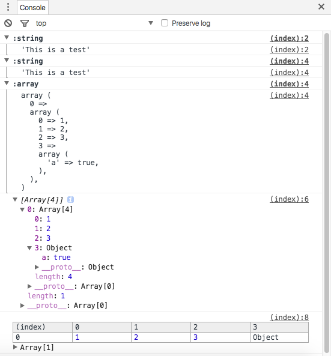

# console-php
console.log for php

### Installation

Install via the `composer` utility.
```
composer require "kingzcheung/console-php"
```
or add the following lines to your `composer.json`:

```json
{
    "require": {
       "kingzcheung/console-php": "^1.0.0"
    }
}
```

### Usage

```php
include "vendor/autoload.php";

use Console\Console;

$data1 = "This is a test";
$data2 = [[1,2,3,['a'=>true]]];

Console::log($data1);
Console::log($data1,$data2);

Console::json($data2);

Console::table($data2);
```


